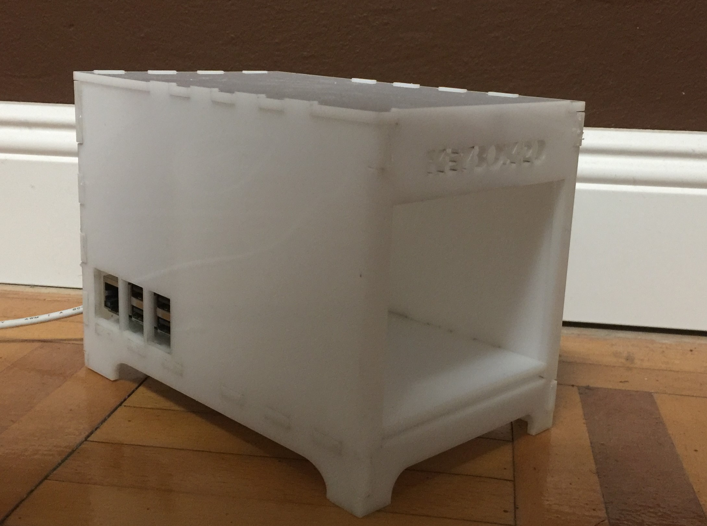

# DC-Box (Detection-Classification) Box
## Plot
The DC-Box should help to start an AI project. It goes through all the necessary stations.
It starts with a use case. What is the purpose of this project? The next step is to collect the necessary data. Where do I get the data from? Choosing the right model for the task at hand. What hardware should be used? Write GUI for the interaction. Dealing with the output.

e.g.: Leaf Box
Recognize and classify leaves or herbs. The images come from a scan box (or from the Internet). A tkinter GUI helps with the recordings. After data acquisition, the model should be prepared for the NUC2.

### 1) Data
Images are essential for a deep learning project. There are two ways to get them.
1) Download from the Internet
2) Produce your own pictures

#### 1) Download from Internet
Here are some useful links

#### 2) Produce your own Images
I like the idea of collecting my own pictures. Because there is good insight into the practical work.
One possibility is a scan box (case).

### 2) Software - GUI
I worked with python and tkinter. The code will come soon.

### 3) Model
Which Model should one use? 
#### a) Pretrained Model

#### b) Costume Model

### 4) Hardware
#### Intel NUC2
#### Raspberry PI

### 5) Output
