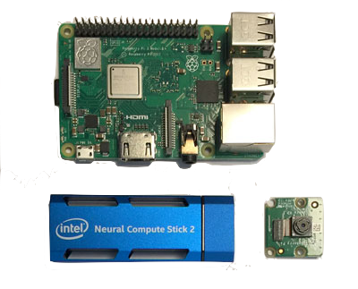
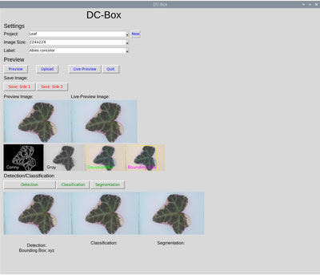

# DC-Box (Detection-Classification) Box

## Plot

What is the DC-BOX and what it is used for.

### Things used in this project:

#### Hardware components:
- Raspberry PI 3 (PI 4 with 4GB is recommanded)
- PI Camera (optional)
- Intel Neural Compute Stick NCS 2
- Lasercutter (optional)
- LED (optional)

#### Software:
To run the project, you need to install the following software.

- Python 3
https://www.raspberrypi.org/documentation/linux/software/python.md
-	OpenCV
https://www.learnopencv.com/install-opencv-4-on-raspberry-pi/
-	Openvino
https://docs.openvinotoolkit.org/latest/_docs_install_guides_installing_openvino_raspbian.html
-	numpy
https://www.raspberrypi.org/forums/viewtopic.php?t=207058
- PIL
https://www.pkimber.net/howto/python/modules/pillow.html

### 1) Housing (Optional)

How the housing was build. including some pictures

### 2) Software Installation:

Installation of the software.

### 3) Training

jupyter notebook

Classification

https://drive.google.com/drive/folders/1wUgWwVYkGkXe6_noGpI24l3Pv4C3Z5RM

Segmentation

https://drive.google.com/file/d/1g30kNgPw7lbjYl2ZZPfFF0KU7SK_QWIV

### 4) Result

How get Results. (Upload or Picamera)
