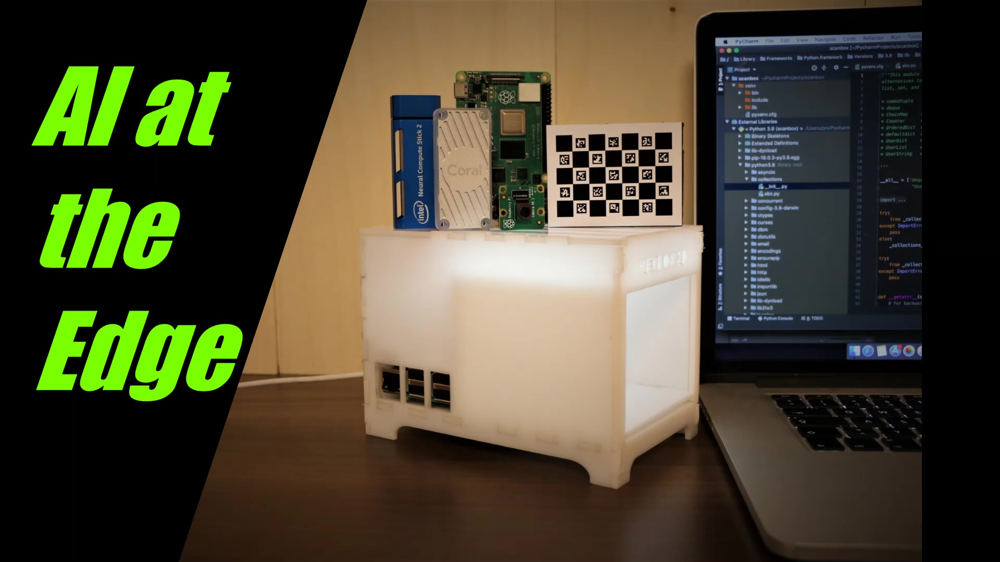

# DC-Box (Detection-Classification) Box
## Plot
The DC-Box should help to start an AI project. It goes through all the necessary stations.
It starts with a use case. What is the purpose of this project? The next step is to collect the necessary data. Where do I get the data from? How do I edit the images with OpenCV. Choosing the right model for the task at hand. Convert and optimize model. What hardware should be used? Write GUI for the interaction. Dealing with the output.

e.g.: Leaf/Herb Box:

Recognize and classify leaves or herbs. The images come from a scan box (or from the Internet). A tkinter GUI helps with the recordings and OpenCV helps with image editing. After data acquisition, the model should be prepared for the NUC2.

### 1) Data
Images are essential for a deep learning project. There are two ways to get them.
1) Download from the Internet
2) Produce your own pictures

#### 1) Download from Internet
Here are some useful links
http://leafsnap.com/

#### 2) Collecting your own Images
I like the idea of collecting my own pictures. Because there is good insight into the practical work.
One possibility is a Scanbox (see: case). You will learn how to collect and prepare images. Data is a very important part of an AI
project. Especially images in an object detection and classification project.

### 2) Software - GUI
I worked with python and tkinter. The code will come soon.

#### OpenCV
For this project basic commands are useful.
e.g.: cv2.imwrite(), cv2.imread() ...

### 3) Model
Which Model should one use? 
#### a) Pretrained Model

#### b) Costume Model
https://drive.google.com/drive/folders/1wUgWwVYkGkXe6_noGpI24l3Pv4C3Z5RM
### 4) Hardware
#### Intel NCS2
#### Raspberry PI
#### Raspberry camera (if you use the Scanbox)

### 5) Result
In the end it should be possible to identify and classify leafs/herbs. 
1) Simply but a new leaf/herb in the Scanbox press "Classify" and the model should get the right typ.
2) Without Scanbox, simply load a new leaf/herb image press "Classify" and the model should get the right typ.
