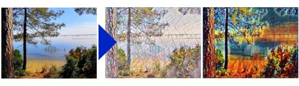

# Style Transfer Camera

Apply style transfer to picture taken from the Raspberry Pi camera.

And create your own style transfer camera/box.

Usable Raspberry Pi model : Pi 3/4. (Models with 1 GB memory will be limited in image input size. The limitation can be overcome by increasing the swap space, but this will greatly increase the inference time)

The code is based on https://github.com/pytorch/examples/tree/master/fast_neural_style

### Required : Pytorch, Torchvision, and Opencv

Go to : https://github.com/nmilosev/pytorch-arm-builds   
Download the wheels for Pytorch and Torchvision (ARMv7 for Pi 3, Aarch64 for Pi 4).    
Install dependencies if needed.

`pip3 install <path of the wheels>`

### Run it! (Graphical User Interface) -- comming soon!

For more information on adding a push button (Box), go to the wiki page : 

### Run it! (command line)

`python neural_style_inf.py eval --content-image </path/to/content/image> --model </path/to/saved/model> --output-image </path/to/output/image> --content-type f`

### Adding a new style

Use the code here :  https://github.com/pytorch/examples/tree/master/fast_neural_style

### Todo

* Make a lightweiht model
* Test Intel Neural Compute Stick
* Capturing timelapse sequences

